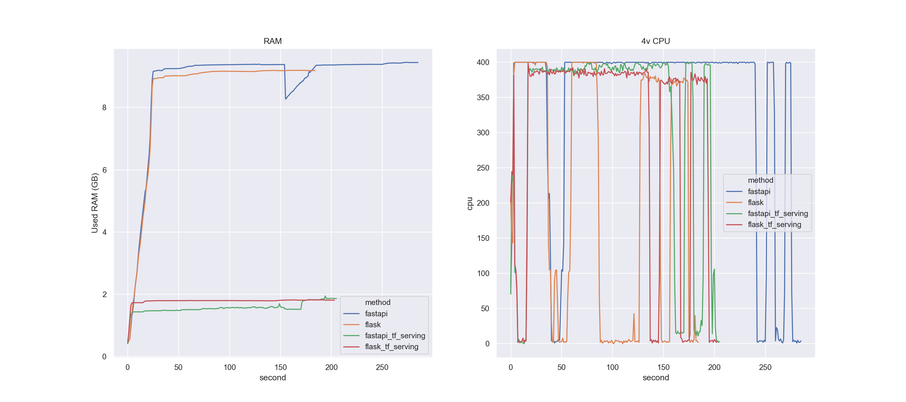
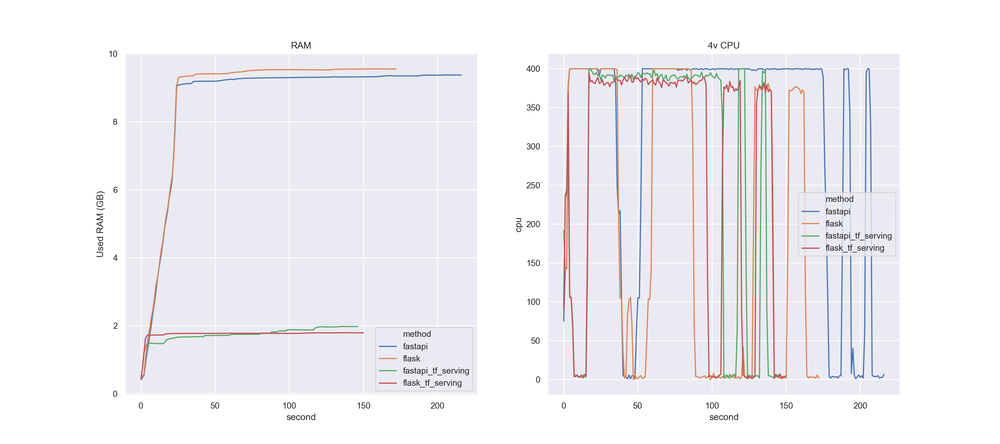
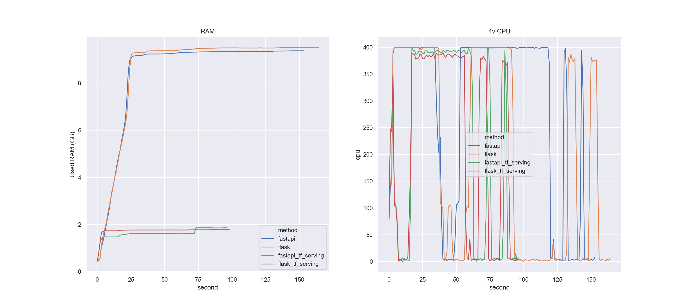

# Bert Serving Benchmark

This repo is a benchmark for different methods of serving BERT.

Requirements:

- docker
- docker-compose
- python3

## Run

Just run, ab test results will be saved to `reports` folder.

```shell
python3 benchmark_runner.py   # run all models

python3 benchmark_runner.py -m flask             # run flask and serve model inside flask
python3 benchmark_runner.py -m flask_tf_serving  # run flask with tf_serving

python3 benchmark_runner.py -m fastapi              # run fastapi and serve model inside fastapi
python3 benchmark_runner.py -m fastapi_tf_serving   # run fastapi with tf_serving
```

## Tasks

- hello_world: return `{"Hello": "World"}` without any operation.
- tokenize: tokenize sentence, convert to np array, then convert it back to list.
- predict: tokenize, then predict with model.

## Result

On GCP `n1-standard-4 (4 vCPU, 15 GB memory)` instance with Ubuntu 20.04 LTS Minimal OS, set `WORKER_COUNT=8`.


```shell
export WORKER_COUNT=8
python3 benchmark_runner.py -n 3000 -c 200
python visualize_result.py -p ./reports/ab_n_3000_c_200
```

| task        | model              |   Failed request |   Concurrency |   Complete requests |   Requests per second |   Time per request |
|:------------|:-------------------|-----------------:|--------------:|--------------------:|----------------------:|-------------------:|
| hello_world | fastapi            |                0 |           400 |               30000 |               4646.06 |             86.094 |
| hello_world | fastapi_tf_serving |                0 |           400 |               30000 |               2846.62 |            140.517 |
| hello_world | flask              |                0 |           400 |               30000 |               1678.35 |            238.329 |
| hello_world | flask_tf_serving   |                0 |           400 |               30000 |               1686.84 |            237.13  |
| predict     | fastapi            |                7 |           200 |                3000 |                 15.54 |          12869.7   |
| predict     | fastapi_tf_serving |             2855 |           200 |                3000 |                 37.01 |           5403.35  |
| predict     | flask              |                0 |           nan |                 nan |                nan    |            nan     |
| predict     | flask_tf_serving   |                0 |           200 |                3000 |                 24.62 |           8123.88  |
| tokenize    | fastapi            |                0 |           400 |               30000 |               3707.93 |            107.877 |
| tokenize    | fastapi_tf_serving |                0 |           400 |               30000 |               2026.76 |            197.36  |
| tokenize    | flask              |                0 |           400 |               30000 |               1481.87 |            269.929 |
| tokenize    | flask_tf_serving   |                0 |           400 |               30000 |               1463.31 |            273.353 |




```shell
export WORKER_COUNT=8
python3 benchmark_runner.py -n 2000 -c 100
python visualize_result.py -p ./reports/ab_n_2000_c_100
```

| task        | model              |   Failed request |   Concurrency |   Complete requests |   Requests per second |   Time per request |
|:------------|:-------------------|-----------------:|--------------:|--------------------:|----------------------:|-------------------:|
| hello_world | fastapi            |                0 |           200 |               20000 |               5017.85 |             39.858 |
| hello_world | fastapi_tf_serving |                0 |           200 |               20000 |               5119.04 |             39.07  |
| hello_world | flask              |                0 |           200 |               20000 |               1697.7  |            117.806 |
| hello_world | flask_tf_serving   |                0 |           200 |               20000 |               1735.41 |            115.246 |
| predict     | fastapi            |                0 |           100 |                2000 |                 15.44 |           6478.27  |
| predict     | fastapi_tf_serving |              287 |           100 |                2000 |                 21.72 |           4603.06  |
| predict     | flask              |                0 |           nan |                 nan |                nan    |            nan     |
| predict     | flask_tf_serving   |                0 |           100 |                2000 |                 24.48 |           4085.34  |
| tokenize    | fastapi            |                0 |           200 |               20000 |               3734.98 |             53.548 |
| tokenize    | fastapi_tf_serving |                0 |           200 |               20000 |               3602.9  |             55.511 |
| tokenize    | flask              |                0 |           200 |               20000 |               1511.37 |            132.331 |
| tokenize    | flask_tf_serving   |                0 |           200 |               20000 |               1546.1  |            129.358 |



```shell
export WORKER_COUNT=8
python3 benchmark_runner.py -n 1000 -c 50
python visualize_result.py -p ./reports/ab_n_1000_c_50
```

| task        | model              |   Failed request |   Concurrency |   Complete requests |   Requests per second |   Time per request |
|:------------|:-------------------|-----------------:|--------------:|--------------------:|----------------------:|-------------------:|
| hello_world | fastapi            |                0 |           100 |               10000 |               4931.38 |             20.278 |
| hello_world | fastapi_tf_serving |                0 |           100 |               10000 |               4986.85 |             20.053 |
| hello_world | flask              |                0 |           100 |               10000 |               1682.14 |             59.448 |
| hello_world | flask_tf_serving   |                0 |           100 |               10000 |               1711.28 |             58.436 |
| predict     | fastapi            |                0 |            50 |                1000 |                 14.16 |           3530.84  |
| predict     | fastapi_tf_serving |                0 |            50 |                1000 |                 21.51 |           2324.42  |
| predict     | flask              |                0 |           nan |                 nan |                nan    |            nan     |
| predict     | flask_tf_serving   |                0 |            50 |                1000 |                 24.38 |           2050.5   |
| tokenize    | fastapi            |                0 |           100 |               10000 |               3536.06 |             28.28  |
| tokenize    | fastapi_tf_serving |                0 |           100 |               10000 |               3261.46 |             30.661 |
| tokenize    | flask              |                0 |           100 |               10000 |               1509.15 |             66.262 |
| tokenize    | flask_tf_serving   |                0 |           100 |               10000 |               1521.78 |             65.712 |



```shell
export WORKER_COUNT=8
python3 benchmark_runner.py -n 500 -c 20
python visualize_result.py -p ./reports/ab_n_500_c_20
```

| task        | model              |   Failed request |   Concurrency |   Complete requests |   Requests per second |   Time per request |
|:------------|:-------------------|-----------------:|--------------:|--------------------:|----------------------:|-------------------:|
| hello_world | fastapi            |                0 |            40 |                5000 |               4440.08 |              9.009 |
| hello_world | fastapi_tf_serving |                0 |            40 |                5000 |               3724.3  |             10.74  |
| hello_world | flask              |                0 |            40 |                5000 |               1671.61 |             23.929 |
| hello_world | flask_tf_serving   |                0 |            40 |                5000 |               1604.04 |             24.937 |
| predict     | fastapi            |                0 |            20 |                 500 |                 12.04 |           1661.27  |
| predict     | fastapi_tf_serving |                0 |            20 |                 500 |                 21.69 |            922.082 |
| predict     | flask              |              409 |            20 |                 500 |                 26.13 |            765.295 |
| predict     | flask_tf_serving   |                0 |            20 |                 500 |                 24.83 |            805.534 |
| tokenize    | fastapi            |                0 |            40 |                5000 |               3307.55 |             12.094 |
| tokenize    | fastapi_tf_serving |                0 |            40 |                5000 |               3010.42 |             13.287 |
| tokenize    | flask              |                0 |            40 |                5000 |               1430.94 |             27.954 |
| tokenize    | flask_tf_serving   |                0 |            40 |                5000 |               1489.08 |             26.862 |


